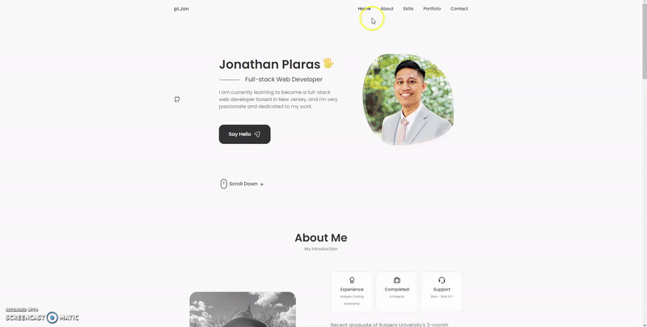

# React Portfolio

by [Jonathan Plaras](https://github.com/pljon/react-portfolio)
https://pljon-react-portfolio.herokuapp.com/

## Description

This react portfolio is all about showcasing my skills and work samples in an organized and easy-to-navigate format. 

The `header` features my name and navigation titles, while the content section includes sections for About Me, Skills, Portfolio, and Contact. 

The `footer` provides quick access to my GitHub, LinkedIn, and a third platform profile. 

In the `About Me` section, you'll find a photo of me and a short bio. 

The `Portfolio` section displays six of my applications with links to both the deployed versions and my corresponding GitHub repository. 

The `Contact` section includes a form for you to get in touch with me, complete with required fields and email address validation. 

Finally, in my About Me section, there's a link to a downloadable version of my `resume` or `CV` and a list of my proficiencies.

## Technologies Used
* [VSCode](https://code.visualstudio.com/)
* [HTML](https://developer.mozilla.org/en-US/docs/Web/HTML)
* [CSS](https://developer.mozilla.org/en-US/docs/Web/CSS)
* [Javascript](https://developer.mozilla.org/en-US/docs/Web/JavaScript)
* [Font Awesome](https://fontawesome.com/)
* [React](https://reactjs.org/)
* [EmailJS](https://www.emailjs.com/)

## Installation

Download the repository or clone it to your local machine by running this command in your terminal:

```
git clone git@github.com:pljon/react-portfolio.git
```

## Usage

Install the dependencies by running these commands in your terminal:

```
npm install
```
Run the application by running this command in your terminal:

```
npm start
```
This is optional, but you should tell your friends or hiring employers about me! 🤭


## Demo

There is also a `.mp4` file of my demo in the `/assets` folder


